# Knilist

<p align="center">
  
</p>

> ⚠️ **Warning:** The app is still in active development, so expect missing features and bugs.

## About

Knilist *(pronounced as **kay-nee-list**)* is an Unofficial Anilist client for Linux written in QML Kirigami + Python.

## Features
- View Anime List and Manga List using interactive cards
- Search for Anime, Manga, Characters, Staff and Anilist Users
- See Anilist notifications for activity
- View Anime Page, Manga Page, Character Page, Staff Page, Studio Page
- View other Anilist Users and their lists
- View your followers and following Anilist Users
- Get Anime Opening and Ending songs and open them via [MPV](https://mpv.io/) or VLC (thanks to [animethemes.moe](https://animethemes.moe/))

## Screenshots
<p align="center">
  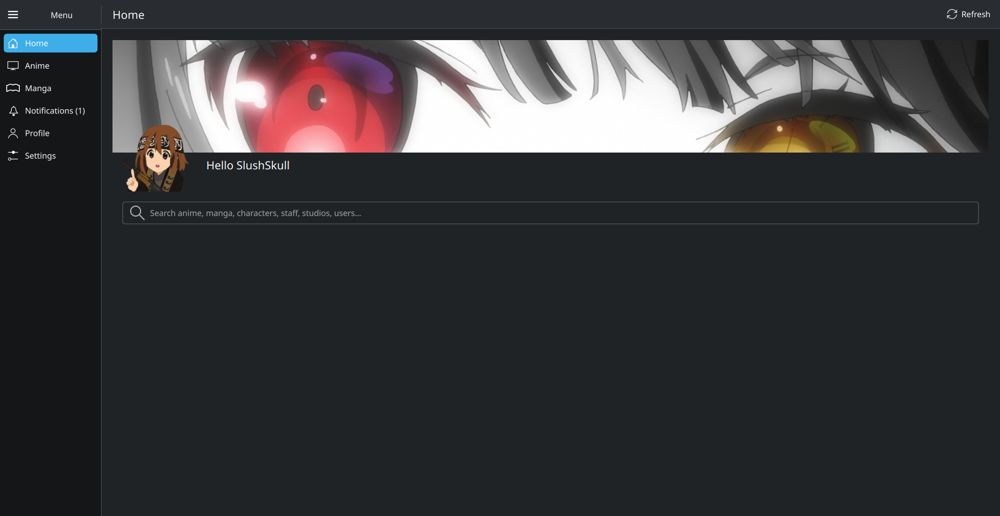
</p>

<p align="center">
  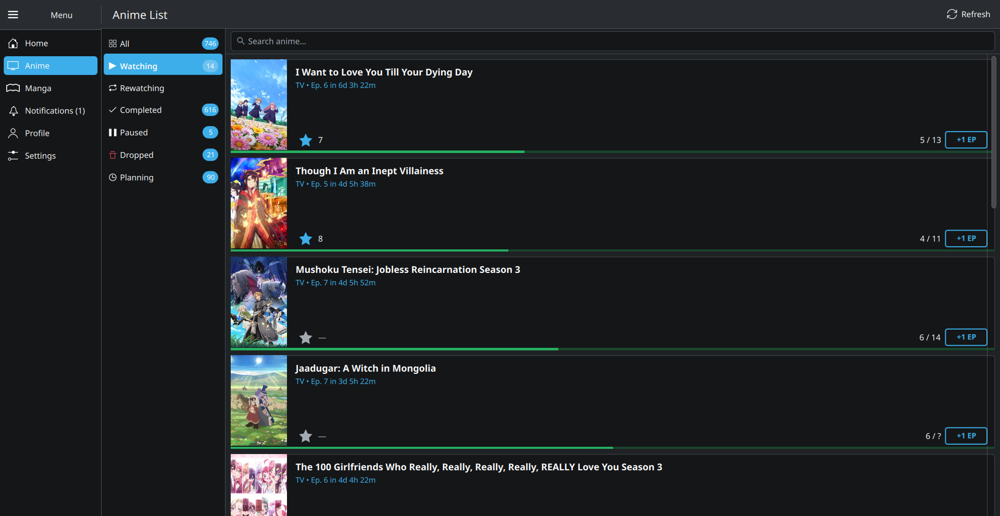
</p>

<p align="center">
  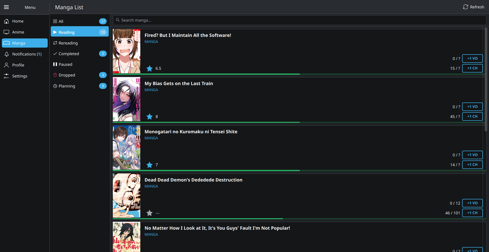
</p>

<p align="center">
  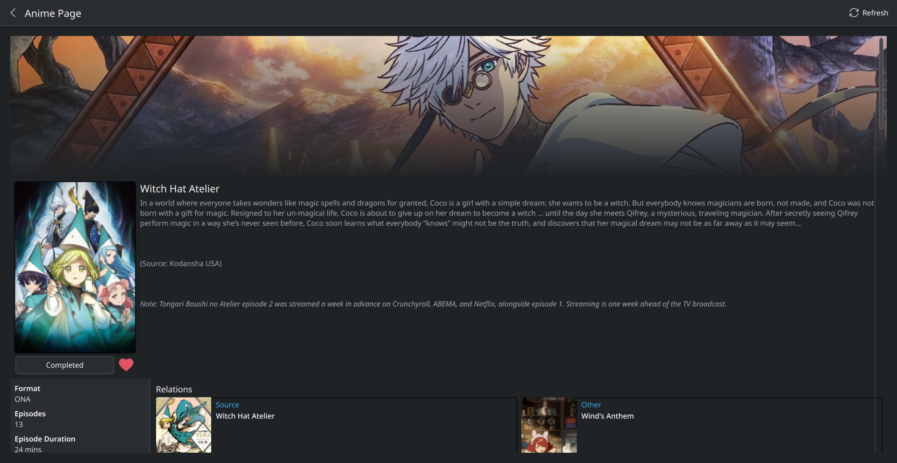
</p>

<p align="center">
  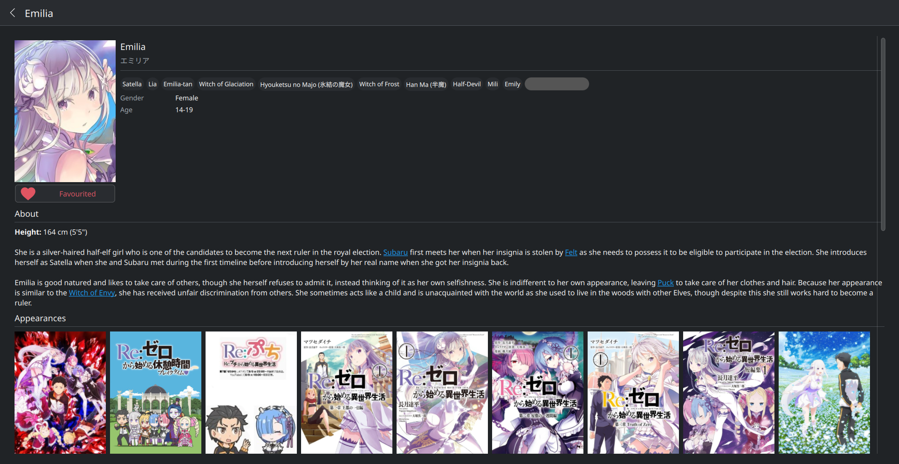
</p>

<p align="center">
  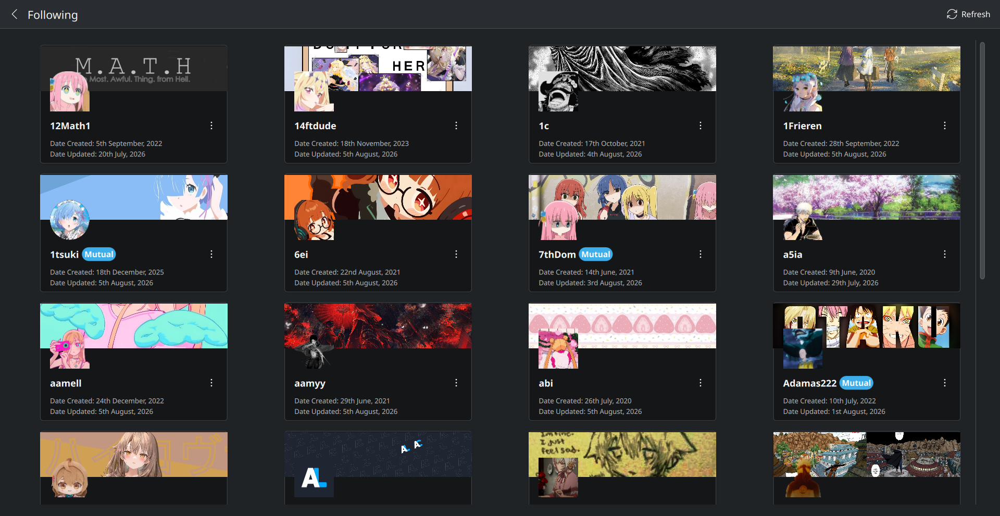
</p>

<p align="center">
  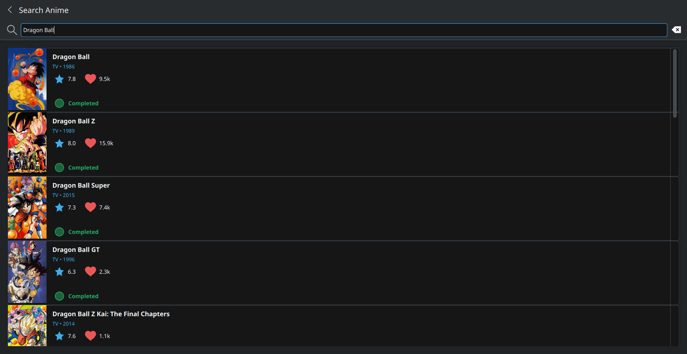
</p>

<p align="center">
  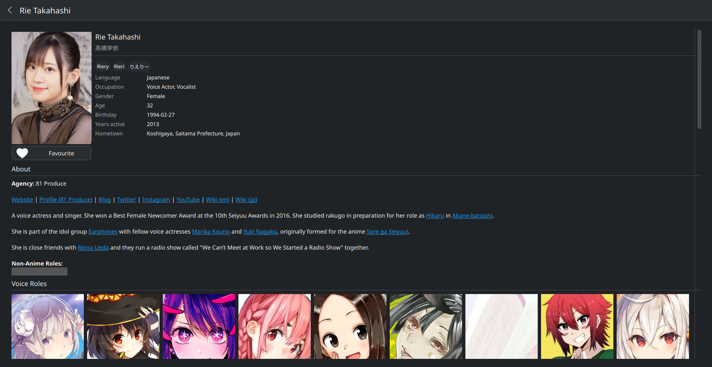
</p>

<p align="center">
  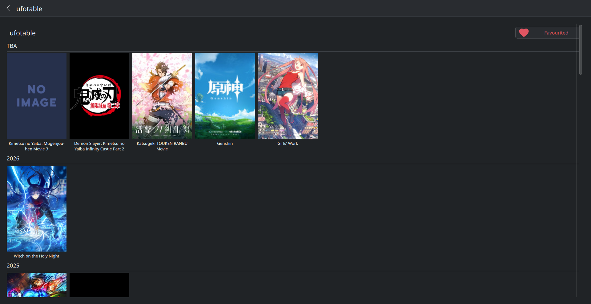
</p>

<p align="center">
  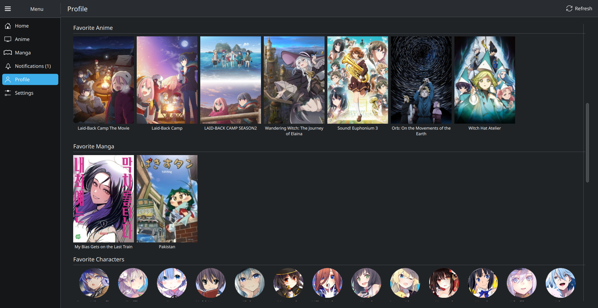
</p>

<p align="center">
  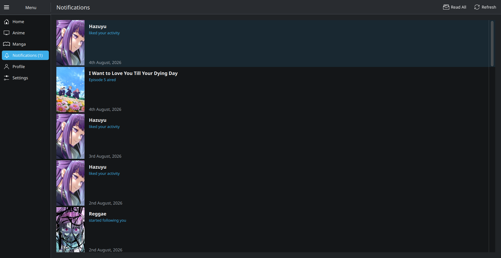
</p>

<p align="center">
  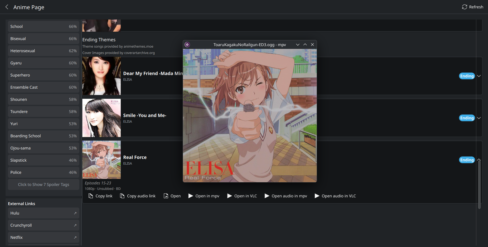
</p>

## Installation

### Option A: Arch Linux (No AUR required)

1. Clone the repository to your local machine in `~/Projects`.

```
cd ~/Projects
```
```
git clone https://github.com/abdul-rafay-mirza/Knilist.git
```
```
cd ~/Projects/Knilist
```

2. Run the install script (recommended)
```
bash install.sh
```
or alternatively run
```
makepkg -si
```

It should now show up in your application launcher as **Knilist**.

### Option B: Flatpak (any distro)

1. Make sure Flathub is added (needed for runtime dependencies):
```
flatpak remote-add --if-not-exists flathub https://flathub.org/repo/flathub.flatpakrepo
```

2. Add the Knilist repository and install:
```
flatpak remote-add --if-not-exists knilist https://abdul-rafay-mirza.github.io/knilist-flatpak/knilist.flatpakrepo
```
```
flatpak install knilist com.github.abdulrafaymirza.knilist
```

3. Run the app through your application launcher or run
```
flatpak run com.github.abdulrafaymirza.knilist
```

## Uninstall

### Arch Linux (pacman)
To completely uninstall the application, either run the uninstall script (recommended):
```
bash uninstall.sh
```
or alternatively, run:
```
sudo pacman -R knilist-git
```

### Flatpak
```
flatpak uninstall com.github.abdulrafaymirza.knilist
```

## Updating:

### Arch
Just run (easiest, recommended):
```
bash install.sh
```
or go to the PKGBUILD directory and run
```
makepkg -si
```

### Flatpak
```
flatpak update com.github.abdulrafaymirza.knilist
```

## Contribution
Contributors are welcome. The easiest way is via pipx:
```
pipx install --force --system-site-packages ~/Projects/Knilist
```
The process is just:
- Make changes
- run pipx install
- Test changes

uninstall using:
```
pipx uninstall knilist
```

## Libraries and Assets Used
- **PySide6, Kirigami, Kirigami Addons**
- **python-requests** to do API requests
- **python-keyring + python-secretstorage** to store Anilist Token
- **AniList GraphQL API**
- **animethemes.moe API**
- **MPV / VLC** are ***not*** bundled dependencies, just external players the app shells out to when the user clicks a theme song

## Planned Features
- Add [anipy-cli](https://github.com/sdaqo/anipy-cli) implementation so that the app can be used to watch anime

## Credits
This projects look and feel was inspired by the [AL-Chan](https://github.com/zend10/AL-chan) Mobile app