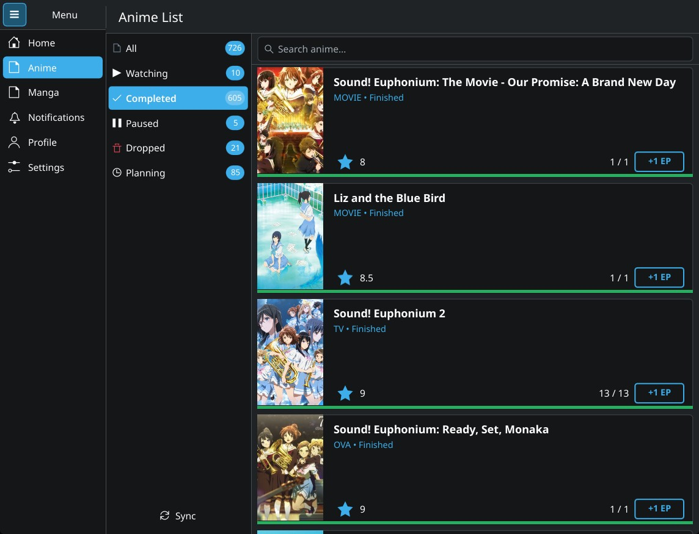

# Knilist



> ⚠️ **Warning:** The app is still in active development, so expect missing features and bugs.

## About:

Knilist is an Anilist client for Arch Linux written in QML Kirigami + Python. It is designed run best under KDE Plasma.

If you have an Arch based Linux distribution (like CachyOS, Manjaro), you can run this application.

## Installation:

1. Clone the repository to your local machine in `~/Projects`.

```
cd ~/Projects
```
```
git clone https://github.com/abdul-rafay-mirza/Knilist.git
```
```
cd ~/Projects/Knilist
```

2. Run the install script
```
bash install.sh
```

It should now show up in your application launcher as **Knilist**.

## Uninstall:
To completely uninstall the application, either run the uninstall script:
```
bash uninstall.sh
```
or alternatively, run:
```
sudo pacmam -R knilist-git
```
> [!IMPORTANT]
> To remove your credentials from KWallet as well, make sure to log out first and only then run the uninstall methods above You can do that by going to **Settings → Logout** .

## Notes:
The `.desktop` file is located in:
```
/usr/share/applications/com.github.abdul-rafay-mirza.knilist.desktop
```
Pacman owns it there, so when you run `sudo pacman -R knilist-git`, it gets removed automatically along with everything else.